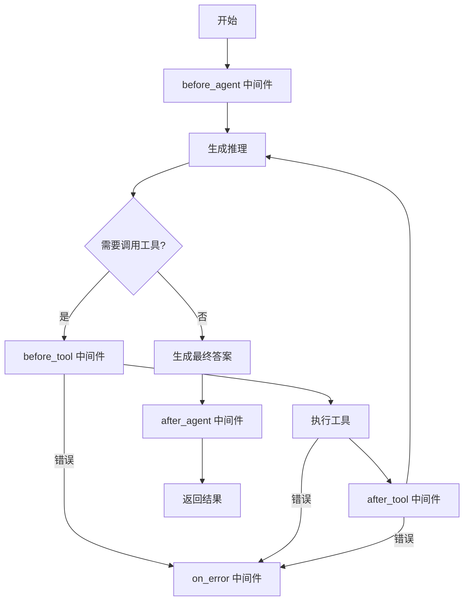

# Rust Create Agent 设计文档

## 概述

基于 `langchain-rust` crate 构建的 Rust 版本 create agent 框架，提供可扩展的中间件系统和 ReAct
Agent 模式支持。与现有 TypeScript `@langgraph-js/standard-agent` 架构对齐，作为三层架构中的框架层组件。

**版本**: v0.1.0  
**状态**: 设计阶段  
**基础框架**: langchain-rust (<https://crates.io/crates/langchain-rust>)  
**对齐目标**: `packages/standard-agent/` (TypeScript)  
**参考文档**:

- <https://docs.langchain.com/oss/python/langchain/agents>
- <https://docs.langchain.com/oss/python/langchain/middleware/custom>
- `packages/standard-agent/src/middlewares/` - 中间件参考实现
- `packages/agent-middlewares/` - 具体工具实现

## 核心需求

### 1. Agent 类型

- **ReAct Agent** (Reasoning + Acting)
    - 推理-行动循环模式
    - 支持多步推理和工具调用
    - 动态决策下一步行动

### 2. 中间件系统

- **设计优先级**: 最高
- **实现优先级**: 抽象层优先，具体实现后续
- **架构要求**:
    - 统一的中间件接口（与 TypeScript `AgentMiddleware` 对齐）
    - 可插拔、可组合
    - 生命周期管理
    - 错误处理机制
    - 支持依赖注入（用于 SubAgent 创建）

### 3. 状态管理

- **存储类型**: 内存状态（无持久化，后续可扩展）
- **状态传递**:
    - Agent 运行时状态
    - 工具调用上下文
    - 中间件共享状态
    - 与 TypeScript `BaseAgentStateType` 对齐（包含 cwd 字段）

### 4. 开发定位

- **目标**: 底层开发框架（框架层）
- **用途**: 对应 TypeScript `@langgraph-js/standard-agent`
- **特性**: 可复用、可扩展的基础组件
- **架构分层**:
    - **框架层**: 中间件基类、工具抽象、状态管理
    - **应用层**: 项目特定中间件（对应 `packages/agent/`）

## 技术架构

### 架构层次

```
┌─────────────────────────────────────┐
│     Application Layer               │  (具体应用)
├─────────────────────────────────────┤
│     Agent Framework                 │  (本框架)
│  ┌───────────────────────────────┐ │
│  │   Agent Executor              │ │
│  │   (ReAct Loop)                │ │
│  ├───────────────────────────────┤ │
│  │   Middleware System           │ │
│  │   (Plugin Architecture)       │ │
│  ├───────────────────────────────┤ │
  │   langchain-rust Tools        │ │  (工具系统)
│  └───────────────────────────────┘ │
├─────────────────────────────────────┤
│     langchain-rust                  │  (基础库)
└─────────────────────────────────────┘
```

### 核心组件

#### 1. AgentExecutor (代理执行器)

**职责**:

- 管理 ReAct 循环
- 协调工具调用
- 处理推理结果

**接口设计**:

```rust
pub struct AgentExecutor<T, S> {
    llm: T,                    // LLM 接口
    tool_executor: ToolExecutor,  // langchain-rust 工具执行器
    middlewares: Vec<Box<dyn Middleware<S>>>,  // 中间件链
    state: S,                  // 状态
    max_iterations: usize,     // 最大迭代次数
}

impl<T: LLM, S: State> AgentExecutor<T, S> {
    pub async fn execute(&mut self, input: AgentInput) -> Result<AgentOutput>;
    pub fn add_middleware(&mut self, middleware: Box<dyn Middleware<S>>);
}
```

#### 2. Middleware Trait (中间件抽象)

**设计原则**:

- 统一接口，灵活实现
- 生命周期钩子
- 可修改状态和输出

**接口定义**:

```rust
#[async_trait]
pub trait Middleware<S: State>: Send + Sync {
    /// 中间件名称
    fn name(&self) -> &str;

    /// Agent 执行前调用
    async fn before_agent(&self, state: &mut S) -> Result<()>;

    /// 工具调用前调用
    async fn before_tool(&self, state: &mut S, tool_call: &ToolCall) -> Result<ToolCall>;

    /// 工具调用后调用
    async fn after_tool(&self, state: &mut S, tool_call: &ToolCall, result: &ToolResult) -> Result<()>;

    /// Agent 执行后调用
    async fn after_agent(&self, state: &mut S, output: &AgentOutput) -> Result<AgentOutput>;

    /// 错误处理
    async fn on_error(&self, state: &mut S, error: &AgentError) -> Result<()>;
}
```

**中间件类型** (抽象定义，具体实现后续):

1. **LoggingMiddleware** - 记录执行日志
2. **MemoryMiddleware** - 管理记忆存储
3. **HumanInTheLoopMiddleware** - 需要用户确认的操作
4. **SubAgentsMiddleware** - 任务委托给子 agent
5. **SkillsMiddleware** - 动态加载技能
6. **MCPMiddleware** - Model Context Protocol 集成

#### 3. Tool System (工具系统)

**职责**:

- 直接使用 langchain-rust 提供的工具系统
- 无需自定义 ToolRegistry 实现

**langchain-rust 工具系统**:

```rust
// 使用 langchain-rust 的工具定义
use langchain_rust::tools::{Tool, ToolExecutor};

// 工具通过 ToolExecutor 管理
let tool_executor = ToolExecutor::new();
tool_executor.add_tool(Box::new(MyCustomTool::new()));

// 调用工具
let result = tool_executor.call("tool_name", input).await?;
```

#### 4. State Manager (状态管理器)

**职责**:

- 管理运行时状态
- 状态传递和共享
- 状态序列化（可选）

**AgentState 具体类型**（与 TypeScript `BaseAgentStateType` 对齐）:

```rust
/// 基础 Agent 状态类型（与 TypeScript BaseAgentStateType 对齐）
#[derive(Debug, Clone, Default)]
pub struct AgentState {
    /// 当前工作目录（必须字段，与 TypeScript 对齐）
    pub cwd: String,

    /// 消息历史
    pub messages: Vec<Message>,

    /// 当前步骤数
    pub current_step: usize,

    /// 附加上下文数据（键值对）
    pub context: HashMap<String, String>,
}

impl AgentState {
    pub fn new(cwd: impl Into<String>) -> Self {
        Self {
            cwd: cwd.into(),
            ..Default::default()
        }
    }

    pub fn add_message(&mut self, message: Message) {
        self.messages.push(message);
    }
}
```

## ReAct 循环实现

### 执行流程



### 核心逻辑

```rust
impl<T: LLM, S: State> AgentExecutor<T, S> {
    pub async fn execute(&mut self, input: AgentInput) -> Result<AgentOutput> {
        // 1. 初始化状态
        let mut state = self.initialize_state(input);

        // 2. Agent 前置中间件
        for middleware in &self.middlewares {
            middleware.before_agent(&mut state).await?;
        }

        // 3. ReAct 循环
        for step in 0..self.max_iterations {
            state.current_step = step;

            // 生成推理和决策
            let reasoning = self.llm.generate_reasoning(&state).await?;

            if reasoning.needs_tool_call() {
                // 工具调用流程
                for tool_call in reasoning.tool_calls {
                    // 前置中间件
                    let modified_call = self.run_before_tool(&mut state, &tool_call).await?;

                    // 执行工具 (使用 langchain-rust 的 ToolExecutor)
                    let result = match self.tool_executor.call(&modified_call.name, modified_call.input).await {
                        Ok(r) => r,
                        Err(e) => {
                            self.run_on_error(&mut state, &e).await?;
                            continue;
                        }
                    };

                    // 后置中间件
                    self.run_after_tool(&mut state, &tool_call, &result).await?;

                    // 更新状态
                    state.add_tool_result(tool_call, result);
                }
            } else {
                // 生成最终答案
                let output = AgentOutput::from_reasoning(reasoning);

                // 后置中间件
                let final_output = self.run_after_agent(&mut state, &output).await?;

                return Ok(final_output);
            }
        }

        Err(AgentError::MaxIterationsExceeded)
    }
}
```

## 与 TypeScript 版本对应关系

### 架构映射

| TypeScript (langgraph-js)  | Rust (本框架)                   | 说明              |
| -------------------------- | ------------------------------- | ----------------- |
| `AgentPackage`             | `AgentExecutor`                 | 核心 Agent 执行器 |
| `AgentMiddleware`          | `Middleware` trait              | 中间件抽象        |
| `ToolRegistry`             | `ToolExecutor` (langchain-rust) | 工具注册表        |
| `AgentState`               | `State` trait + `AgentState`    | 状态管理          |
| `SubAgentsMiddleware`      | 待实现                          | 子 Agent 委托     |
| `MCPMiddleware`            | 待实现                          | MCP 集成          |
| `HumanInTheLoopMiddleware` | 待实现                          | HITL 确认         |

### 中间件生命周期对应

```rust
// Rust 中间件生命周期
async fn before_agent(&self, state: &mut S) -> Result<()>;
async fn before_tool(&self, state: &mut S, tool_call: &ToolCall) -> Result<ToolCall>;
async fn after_tool(&self, state: &mut S, tool_call: &ToolCall, result: &ToolResult) -> Result<()>;
async fn after_agent(&self, state: &mut S, output: &AgentOutput) -> Result<AgentOutput>;
async fn on_error(&self, state: &mut S, error: &AgentError) -> Result<()>;
```

### TypeScript 参考实现

参考文件位置：

- `packages/standard-agent/src/middlewares/subagents/`
- `packages/standard-agent/src/middlewares/hitl/`
- `packages/standard-agent/src/package.ts`

## 项目结构规划

```
rust-create-agent/
├── Cargo.toml
├── src/
│   ├── lib.rs                      # 库入口
│   ├── agent/
│   │   ├── mod.rs                 # Agent 模块
│   │   ├── executor.rs            # AgentExecutor 实现
│   │   ├── react.rs               # ReAct 逻辑
│   │   └── state.rs               # 状态管理
│   ├── middleware/
│   │   ├── mod.rs                 # 中间件模块
│   │   ├── trait.rs               # Middleware trait 定义
│   │   ├── chain.rs               # 中间件链
│   │   └── base.rs                # 基础中间件实现
│   ├── llm/
│   │   ├── mod.rs                 # LLM 抽象
│   │   └── adapter.rs             # langchain-rust 适配器
│   └── error.rs                   # 错误类型定义
├── examples/
│   ├── basic_agent.rs             # 基础 Agent 示例
│   ├── custom_middleware.rs       # 自定义中间件示例
│   └── tool_integration.rs        # 工具集成示例
└── tests/
    ├── middleware_tests.rs        # 中间件测试
    ├── agent_tests.rs             # Agent 测试
    └── integration_tests.rs        # 集成测试
```

## 实现优先级

### Phase 1: 核心抽象 (当前阶段)

- [x] 需求分析和设计文档
- [ ] `Middleware` trait 定义
- [ ] `State` trait 定义
- [ ] 基础数据结构 (AgentInput, AgentOutput, ToolCall, ToolResult)

### Phase 2: Agent 执行器

- [ ] `AgentExecutor` 基础实现
- [ ] ReAct 循环逻辑
- [ ] 集成 langchain-rust ToolExecutor
- [ ] 错误处理机制

### Phase 3: 中间件系统

- [ ] 中间件链管理
- [ ] 生命周期钩子实现
- [ ] 示例中间件 (LoggingMiddleware)
- [ ] 中间件测试

### Phase 4: LLM 集成

- [ ] langchain-rust LLM 适配器
- [ ] LLM trait 抽象
- [ ] Prompt 模板系统
- [ ] 流式输出支持

### Phase 5: 具体中间件实现 (后续)

- [ ] HumanInTheLoopMiddleware
- [ ] SubAgentsMiddleware
- [ ] MCPMiddleware
- [ ] SkillsMiddleware

## 技术选型

### 依赖安装

```bash
# 核心
cargo add langchain-rust
cargo add tokio --features full
cargo add async-trait

# 序列化
cargo add serde --features derive
cargo add serde_json

# 错误处理
cargo add anyhow
cargo add thiserror

# 类型安全
cargo add dyn-clone

# 开发依赖
cargo add tokio-test --dev
```

### Rust 版本

- **MSRV**: Rust 1.75+
- **Edition**: 2021

## 示例代码

### 基础 Agent 使用

```rust
use rust_create_agent::{
    AgentExecutor, AgentState,
    middleware::LoggingMiddleware,
};
use langchain_rust::tools::{Tool, ToolExecutor};

#[tokio::main]
async fn main() -> anyhow::Result<()> {
    // 使用 langchain-rust 的工具系统
    let mut tool_executor = ToolExecutor::new();
    tool_executor.add_tool(Box::new(MyCustomTool::new()));

    // 创建 Agent
    let mut agent = AgentExecutor::new(llm, tool_executor)
        .max_iterations(10)
        .add_middleware(Box::new(LoggingMiddleware::new()));

    // 执行
    let input = AgentInput::text("执行某个任务");
    let output = agent.execute(input).await?;

    println!("{}", output.text);
    Ok(())
}
```

### 自定义中间件

```rust
use rust_create_agent::middleware::{Middleware, MiddlewareContext};
use async_trait::async_trait;

struct CustomMiddleware {
    config: String,
}

#[async_trait]
impl<S: State> Middleware<S> for CustomMiddleware {
    fn name(&self) -> &str {
        "custom"
    }

    async fn before_agent(&self, state: &mut S) -> Result<()> {
        println!("Agent 开始执行");
        Ok(())
    }

    async fn after_tool(&self, state: &mut S, tool_call: &ToolCall, result: &ToolResult) -> Result<()> {
        println!("工具 {} 执行完成: {:?}", tool_call.name, result);
        Ok(())
    }
}
```

## 测试策略

### 单元测试

- 每个 trait 实现的独立测试
- 状态管理测试
- 中间件生命周期测试

### 集成测试

- 完整 ReAct 循环测试
- 多中间件组合测试
- 错误处理测试

### 示例测试

- examples/ 目录下的代码编译和运行测试

## 后续扩展方向

1. **持久化状态**: 数据库状态存储
2. **分布式执行**: Agent 任务分发
3. **WebAssembly**: WASM 编译支持
4. **性能优化**: 并行工具调用
5. **类型安全**: 更强的类型推导
6. **可视化**: Agent 执行轨迹可视化

## 参考资料

- LangChain Python: <https://docs.langchain.com/oss/python/langchain/agents>
- LangChain Custom Middleware: <https://docs.langchain.com/oss/python/langchain/middleware/custom>
- Rust async patterns: <https://rust-lang.github.io/async-book/>
- langchain-rust: <https://crates.io/crates/langchain-rust>

---

**文档版本**: v0.1.0  
**最后更新**: 2025-03-16  
**作者**: Claude  
**状态**: 待审核
