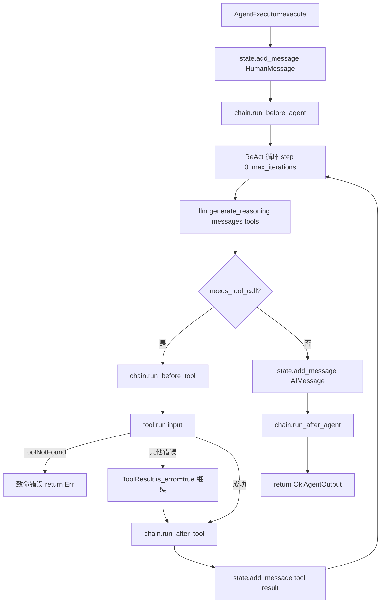

# Rust Create Agent 设计文档

## 概述

基于 `langchain-rust` crate 构建的 Rust 版本 create agent 框架，提供可扩展的中间件系统和 ReAct
Agent 模式支持。与现有 TypeScript `@langgraph-js/standard-agent` 架构对齐，作为三层架构中的框架层组件。

**版本**: v0.2.0  
**状态**: 开发中  
**基础框架**: langchain-rust (<https://crates.io/crates/langchain-rust>)  
**对齐目标**: `packages/standard-agent/` (TypeScript)  
**参考文档**:

- `packages/standard-agent/src/middlewares/` - 中间件参考实现
- `packages/agent-middlewares/` - 具体工具实现

## 核心需求

### 1. Agent 类型

- **ReAct Agent** (Reasoning + Acting)
    - 推理-行动循环模式
    - 支持多步推理和工具调用
    - 动态决策下一步行动

### 2. 中间件系统

- **设计优先级**: 最高
- **架构要求**:
    - 统一的中间件接口（与 TypeScript `AgentMiddleware` 对齐）
    - 可插拔、可组合
    - 生命周期管理（5 个钩子）
    - 错误处理机制

### 3. 状态管理

- **存储类型**: 内存状态（无持久化，后续可扩展）
- **状态格式**: 使用 `langchain-rust` 标准 `Message` 类型
- **对齐目标**: TypeScript `BaseAgentStateType`（包含 `cwd` 字段）

### 4. Agent 静态声明

- **背景**: Agent 的工具集和中间件组合在多数场景下是固定的，适合在编译期声明
- **目标**: 通过 `AgentDef` trait 将 agent 配置从命令式构建迁移到声明式定义
- **优势**:
    - 配置集中，一处声明，多处复用
    - 与 TypeScript `subagents/config.ts` 的声明式风格对齐
    - 便于序列化、远程加载、动态注册

### 5. 开发定位

- **目标**: 底层开发框架（框架层）
- **用途**: 对应 TypeScript `@langgraph-js/standard-agent`
- **特性**: 可复用、可扩展的基础组件

## 技术架构

### 架构层次

```
┌─────────────────────────────────────┐
│     Application Layer               │  (具体应用)
│  struct DefaultAgent;               │
│  impl AgentDef for DefaultAgent {}  │  ← 静态声明
├─────────────────────────────────────┤
│     Agent Framework (本库)           │
│  ┌──────────────────────────────┐  │
│  │   AgentExecutor (ReAct Loop) │  │
│  ├──────────────────────────────┤  │
│  │   AgentDef trait             │  │  ← 声明式配置接口
│  ├──────────────────────────────┤  │
│  │   MiddlewareChain            │  │
│  ├──────────────────────────────┤  │
│  │   langchain-rust Tool / LLM  │  │
│  └──────────────────────────────┘  │
├─────────────────────────────────────┤
│     langchain-rust                  │  (基础库)
└─────────────────────────────────────┘
```

### 核心组件

#### 1. AgentDef Trait（静态声明，新增）

**设计原则**:

- 一个 `struct` + 一个 `impl AgentDef` 完整描述一个 agent
- 所有方法提供默认值，只需覆盖需要定制的部分
- 与 TypeScript `subagents/config.ts` 中 `loadAgentsList()` 的声明风格对齐

**接口定义**:

```rust
pub trait AgentDef {
    /// Agent 唯一标识
    fn id() -> &'static str;

    /// Agent 显示名称
    fn name() -> &'static str { Self::id() }

    /// Agent 系统提示词
    fn system_prompt() -> Option<String> { None }

    /// 最大迭代次数
    fn max_iterations() -> usize { 10 }

    /// 声明该 agent 使用的工具列表
    fn tools() -> Vec<Box<dyn Tool>>;

    /// 声明该 agent 使用的中间件列表
    fn middlewares() -> Vec<Box<dyn Middleware<AgentState>>>;
}
```

**从声明构建执行器**:

```rust
impl<L: ReactLLM, S: State> AgentExecutor<L, S> {
    /// 从 AgentDef 声明构建 AgentExecutor
    pub fn from_def<D: AgentDef>(llm: L) -> Self {
        let mut executor = Self::new(llm).max_iterations(D::max_iterations());
        for tool in D::tools() {
            executor = executor.register_tool(tool);
        }
        for mw in D::middlewares() {
            executor = executor.add_middleware(mw);
        }
        executor
    }
}
```

**使用示例**:

```rust
// 声明 agent（对应 TypeScript subagents/config.ts）
struct DefaultAgent;

impl AgentDef for DefaultAgent {
    fn id() -> &'static str { "default" }
    fn name() -> &'static str { "Jarvis" }

    fn system_prompt() -> Option<String> {
        Some("你是一个全能代码助手。".into())
    }

    fn tools() -> Vec<Box<dyn Tool>> {
        vec![
            Box::new(FilesystemTool::new()),
            Box::new(TerminalTool::new()),
        ]
    }

    fn middlewares() -> Vec<Box<dyn Middleware<AgentState>>> {
        vec![
            Box::new(LoggingMiddleware::new()),
            Box::new(HumanInTheLoopMiddleware::new()),
        ]
    }
}

struct ManagerAgent;

impl AgentDef for ManagerAgent {
    fn id() -> &'static str { "manager" }
    fn name() -> &'static str { "任务管理员" }

    fn tools() -> Vec<Box<dyn Tool>> {
        vec![Box::new(TaskTool::new())]
    }

    fn middlewares() -> Vec<Box<dyn Middleware<AgentState>>> {
        vec![
            Box::new(LoggingMiddleware::new()),
            // manager 不启用 MCP（与 TypeScript 版本保持一致）
        ]
    }
}

// 运行时从声明构建
let agent = AgentExecutor::from_def::<DefaultAgent>(llm);
let output = agent.execute(input, &mut state).await?;
```

#### 2. AgentExecutor（代理执行器）

**职责**:

- 管理 ReAct 循环
- 协调工具调用（使用 `langchain-rust::tools::Tool`）
- 驱动中间件链

**接口**:

```rust
pub struct AgentExecutor<L: ReactLLM, S: State> {
    llm: L,
    tools: HashMap<String, Box<dyn Tool>>,  // langchain-rust Tool
    chain: MiddlewareChain<S>,
    max_iterations: usize,
}

impl<L: ReactLLM, S: State> AgentExecutor<L, S> {
    pub fn new(llm: L) -> Self;
    pub fn from_def<D: AgentDef>(llm: L) -> Self;     // 从声明构建
    pub fn register_tool(self, tool: Box<dyn Tool>) -> Self;
    pub fn add_middleware(self, mw: Box<dyn Middleware<S>>) -> Self;
    pub async fn execute(&self, input: AgentInput, state: &mut S) -> AgentResult<AgentOutput>;
}
```

#### 3. Middleware Trait（中间件抽象）

**5 个生命周期钩子**（均有默认 no-op 实现）:

```rust
#[async_trait]
pub trait Middleware<S: State>: Send + Sync {
    fn name(&self) -> &str;

    async fn before_agent(&self, state: &mut S) -> AgentResult<()>;
    async fn before_tool(&self, state: &mut S, tool_call: &ToolCall) -> AgentResult<ToolCall>;
    async fn after_tool(&self, state: &mut S, tool_call: &ToolCall, result: &ToolResult) -> AgentResult<()>;
    async fn after_agent(&self, state: &mut S, output: &AgentOutput) -> AgentResult<AgentOutput>;
    async fn on_error(&self, state: &mut S, error: &AgentError) -> AgentResult<()>;
}
```

**已实现的中间件**:

| 中间件              | 说明                            |
| ------------------- | ------------------------------- |
| `LoggingMiddleware` | 记录执行日志，支持 verbose 模式 |
| `MetricsMiddleware` | 统计工具调用次数和步骤数        |
| `NoopMiddleware`    | 空实现，用于测试或占位          |

**待实现的中间件**:

| 中间件                     | 对应 TypeScript            | 说明               |
| -------------------------- | -------------------------- | ------------------ |
| `HumanInTheLoopMiddleware` | `HumanInTheLoopMiddleware` | 敏感操作需用户确认 |
| `SubAgentsMiddleware`      | `SubAgentsMiddleware`      | 任务委托给子 agent |
| `MCPMiddleware`            | `MCPMiddleware`            | MCP 服务器集成     |
| `SkillsMiddleware`         | `SkillsMiddleware`         | 动态加载技能       |
| `MemoriesMiddleware`       | `MemoriesMiddleware`       | 渐进式加载记忆     |

#### 4. Tool System（工具系统）

**直接使用 `langchain-rust` 的 `Tool` trait**，无需自定义：

```rust
// langchain-rust Tool trait
pub trait Tool: Send + Sync {
    fn name(&self) -> String;
    fn description(&self) -> String;
    fn parameters(&self) -> Value { ... }          // OpenAI function calling schema
    async fn run(&self, input: Value) -> Result<String, Box<dyn Error>>;
}
```

**ToolRegistry** 作为运行时工具查找表，由 `AgentExecutor` 内部管理。

#### 5. ReactLLM Trait（推理接口）

**在 `langchain-rust LLM` 之上增加 ReAct 推理能力**:

```rust
#[async_trait]
pub trait ReactLLM: Send + Sync {
    /// 接收 langchain-rust 标准消息 + 工具列表，返回推理结果
    async fn generate_reasoning(
        &self,
        messages: &[LCMessage],
        tools: &[&dyn Tool],
    ) -> AgentResult<Reasoning>;
}
```

**内置实现**:

- `MockLLM` — 测试用，按预设脚本返回推理序列
- `LangChainLLM<L>` — 包装任意 `langchain_rust::language_models::llm::LLM`（OpenAI、Claude 等）

#### 6. State Trait（状态管理）

**与 TypeScript `BaseAgentStateType` 对齐**:

```rust
pub trait State: Send + Sync + Clone + 'static {
    fn cwd(&self) -> &str;
    fn set_cwd(&mut self, cwd: impl Into<String>);
    fn messages(&self) -> &[LCMessage];     // langchain-rust 标准消息
    fn add_message(&mut self, message: LCMessage);
    fn current_step(&self) -> usize;
    fn set_current_step(&mut self, step: usize);
}

// 内置实现
pub struct AgentState {
    pub cwd: String,
    pub messages: Vec<LCMessage>,
    pub current_step: usize,
    pub context: HashMap<String, String>,
}
```

## ReAct 循环实现

### 执行流程



### 错误处理策略

| 错误类型                | 处理方式                                                 |
| ----------------------- | -------------------------------------------------------- |
| `ToolNotFound`          | 致命错误，立即终止并返回 `Err`                           |
| `ToolExecutionFailed`   | 软错误，记录为 `ToolResult { is_error: true }`，继续循环 |
| `MaxIterationsExceeded` | LLM 未在限制内给出最终答案                               |
| `LlmError`              | LLM 调用失败，触发 `on_error` 后终止                     |
| `MiddlewareError`       | 中间件内部错误，触发 `on_error` 后终止                   |

## 与 TypeScript 版本对应关系

### 架构映射

| TypeScript (`standard-agent`)            | Rust (本框架)                     | 说明                |
| ---------------------------------------- | --------------------------------- | ------------------- |
| `AgentPackage`                           | `AgentExecutor`                   | 核心执行器          |
| `AgentMiddleware`                        | `Middleware<S>` trait             | 中间件接口          |
| `ToolRegistry`                           | `langchain-rust` Tool + `HashMap` | 工具管理            |
| `BaseAgentStateType`                     | `State` trait + `AgentState`      | 状态类型            |
| `subagents/config.ts` `loadAgentsList()` | `AgentDef` trait impl             | **静态 Agent 声明** |
| `createAgent` 回调                       | `AgentExecutor::from_def::<D>()`  | 从声明构建执行器    |
| `SubAgentsMiddleware`                    | 待实现                            | 子 Agent 委托       |
| `MCPMiddleware`                          | 待实现                            | MCP 集成            |
| `HumanInTheLoopMiddleware`               | 待实现                            | HITL 确认           |

### TypeScript 参考实现

- `packages/standard-agent/src/middlewares/`
- `packages/standard-agent/src/package.ts`
- `packages/agent/src/subagents/config.ts`

## 项目结构

```
rust-create-agent/
├── Cargo.toml
├── src/
│   ├── lib.rs                      # 库入口 + prelude
│   ├── error.rs                    # AgentError / AgentResult
│   ├── agent/
│   │   ├── mod.rs
│   │   ├── executor.rs             # AgentExecutor + from_def
│   │   ├── react.rs                # ReactLLM、ToolCall、AgentInput/Output 等
│   │   └── state.rs                # State trait + AgentState
│   ├── def/                        # (待新增) AgentDef trait
│   │   └── mod.rs                  # AgentDef trait 定义
│   ├── middleware/
│   │   ├── mod.rs
│   │   ├── trait.rs                # Middleware trait（5 钩子）
│   │   ├── chain.rs                # MiddlewareChain 顺序执行
│   │   └── base.rs                 # LoggingMiddleware、MetricsMiddleware
│   └── llm/
│       ├── mod.rs
│       └── adapter.rs              # MockLLM、LangChainLLM<L>
├── examples/
│   ├── basic_agent.rs              # 基础用法
│   ├── custom_middleware.rs        # 自定义中间件
│   └── tool_integration.rs         # 工具集成 + ReAct
└── tests/
    ├── agent_tests.rs              # AgentExecutor 测试
    ├── middleware_tests.rs         # 中间件链测试
    └── integration_tests.rs        # 完整 ReAct 循环测试
```

## 实现进度

### Phase 1: 核心抽象 ✅

- [x] `Middleware<S>` trait（5 钩子，均有默认实现）
- [x] `State` trait + `AgentState`
- [x] 基础数据结构（`AgentInput`、`AgentOutput`、`ToolCall`、`ToolResult`、`Reasoning`）
- [x] `AgentError` / `AgentResult`

### Phase 2: Agent 执行器 ✅

- [x] `AgentExecutor` 基础实现（Builder 模式）
- [x] ReAct 循环（含错误处理策略）
- [x] 集成 `langchain-rust::tools::Tool`
- [x] `ToolNotFound` 致命 vs 软错误区分

### Phase 3: 中间件系统 ✅

- [x] `MiddlewareChain` 顺序执行
- [x] `LoggingMiddleware`（含 verbose 模式）
- [x] `MetricsMiddleware`
- [x] `NoopMiddleware`
- [x] 中间件测试覆盖

### Phase 4: LLM 集成 ✅

- [x] `ReactLLM` trait（ReAct 推理接口）
- [x] `MockLLM`（脚本化，用于测试）
- [x] `LangChainLLM<L>`（包装 langchain-rust 任意 LLM）
- [x] `langchain-rust::schemas::Message` 作为消息标准格式

### Phase 5: Agent 静态声明（进行中）

- [ ] `AgentDef` trait 定义（`src/def/mod.rs`）
- [ ] `AgentExecutor::from_def::<D>()` 构建方法
- [ ] `DefaultAgent`、`ManagerAgent` 声明示例
- [ ] `AgentDef` 相关测试

### Phase 6: 具体中间件实现（待规划）

- [ ] `HumanInTheLoopMiddleware`
- [ ] `SubAgentsMiddleware`
- [ ] `MCPMiddleware`
- [ ] `SkillsMiddleware`
- [ ] `MemoriesMiddleware`

## 技术选型

### 依赖

```toml
[dependencies]
langchain-rust = "4.6"          # 基础框架（Tool、LLM、Message）
tokio = { version = "1", features = ["full"] }
async-trait = "0.1"
serde = { version = "1", features = ["derive"] }
serde_json = "1"
anyhow = "1"
thiserror = "2"
dyn-clone = "1"

[dev-dependencies]
tokio-test = "0.4"
```

### Rust 版本

- **MSRV**: Rust 1.75+
- **Edition**: 2021

## 示例代码

### 命令式构建（当前支持）

```rust
use rust_create_agent::prelude::*;

let agent = AgentExecutor::new(llm)
    .max_iterations(10)
    .register_tool(Box::new(CalculatorTool))
    .add_middleware(Box::new(LoggingMiddleware::new()));

let mut state = AgentState::new("/workspace");
let output = agent.execute(AgentInput::text("计算 42 + 58"), &mut state).await?;
```

### 声明式定义（Phase 5，设计中）

```rust
use rust_create_agent::prelude::*;

// 静态声明 agent
struct DefaultAgent;

impl AgentDef for DefaultAgent {
    fn id() -> &'static str { "default" }
    fn name() -> &'static str { "Jarvis" }

    fn tools() -> Vec<Box<dyn Tool>> {
        vec![
            Box::new(FilesystemTool::new()),
            Box::new(TerminalTool::new()),
        ]
    }

    fn middlewares() -> Vec<Box<dyn Middleware<AgentState>>> {
        vec![
            Box::new(LoggingMiddleware::new()),
            Box::new(HumanInTheLoopMiddleware::new()),
        ]
    }
}

// 从声明构建
let agent = AgentExecutor::from_def::<DefaultAgent>(llm);
let output = agent.execute(input, &mut state).await?;
```

### 自定义中间件

```rust
use async_trait::async_trait;
use rust_create_agent::prelude::*;

struct AuditMiddleware;

#[async_trait]
impl Middleware<AgentState> for AuditMiddleware {
    fn name(&self) -> &str { "audit" }

    async fn before_tool(&self, _state: &mut AgentState, call: &ToolCall) -> AgentResult<ToolCall> {
        println!("[audit] tool: {} input: {}", call.name, call.input);
        Ok(call.clone())
    }

    async fn on_error(&self, _state: &mut AgentState, err: &AgentError) -> AgentResult<()> {
        eprintln!("[audit] error: {err}");
        Ok(())
    }
}
```

## 测试策略

| 测试类型   | 文件                         | 覆盖内容                                 |
| ---------- | ---------------------------- | ---------------------------------------- |
| 单元测试   | `src/agent/state.rs`         | State 基本操作                           |
| Agent 测试 | `tests/agent_tests.rs`       | ReAct 循环、工具调用、错误处理、迭代上限 |
| 中间件测试 | `tests/middleware_tests.rs`  | 钩子顺序、链式修改、no-op                |
| 集成测试   | `tests/integration_tests.rs` | 多步工具调用、多中间件组合               |

## 后续扩展方向

1. **AgentDef 注册表** — 运行时 `HashMap<&str, AgentDefBuilder>` 支持动态注册
2. **持久化状态** — 数据库状态存储
3. **并行工具调用** — 多工具同步执行提升性能
4. **流式输出** — 支持 `langchain-rust` streaming API
5. **WebAssembly** — WASM 编译支持
6. **可视化** — Agent 执行轨迹可视化

## 参考资料

- langchain-rust: <https://crates.io/crates/langchain-rust>
- langchain-rust docs: <https://docs.rs/langchain-rust>
- Rust async patterns: <https://rust-lang.github.io/async-book/>

---

**文档版本**: v0.2.0  
**最后更新**: 2026-03-16  
**作者**: Claude  
**状态**: 开发中
